# paneline


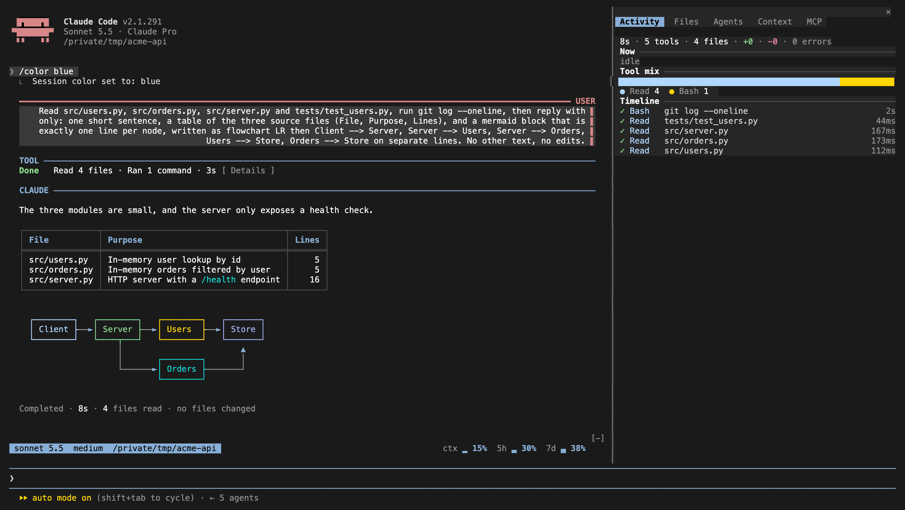

paneline is a Claude Code mod (plugin) that adds a side pane with Activity, Files, Agents, Context and MCP tabs, a status line above the prompt, a restyled chat, terminal Mermaid diagrams, tables, code panels and diff panels. Colours follow your session `/color` and `/theme`.

## How it looks

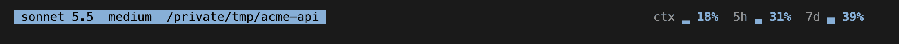

Status row

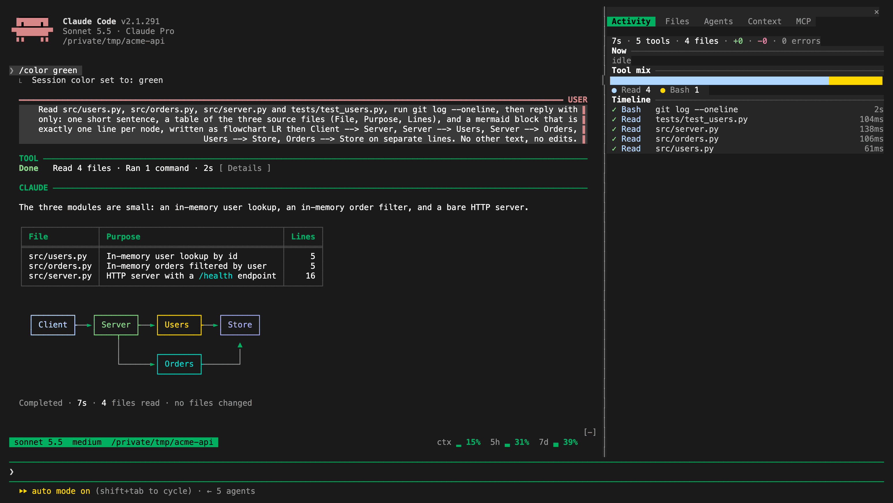
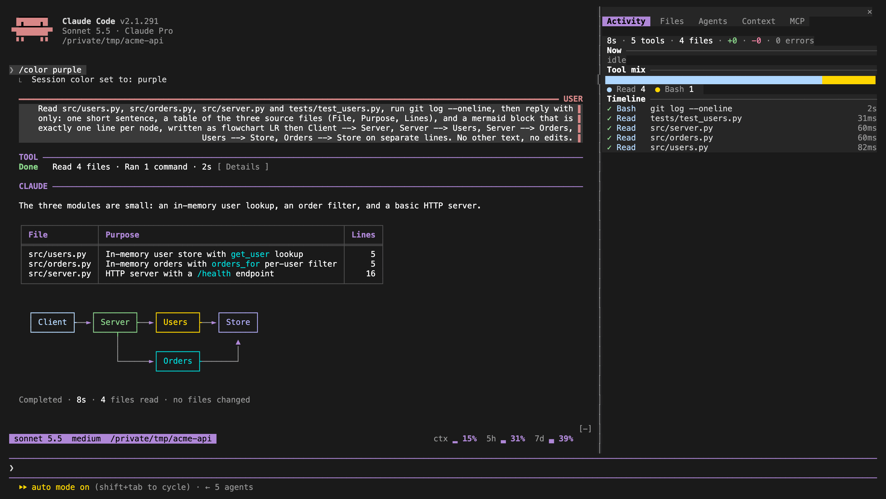
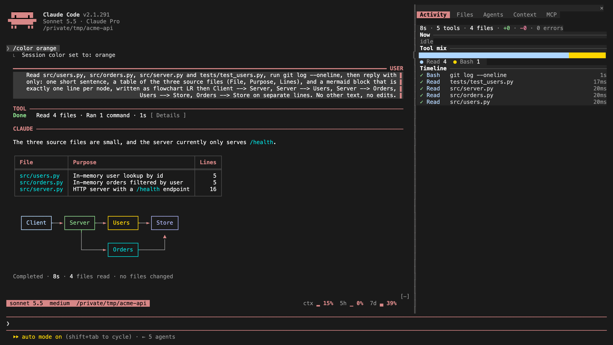

Green, purple and orange sessions

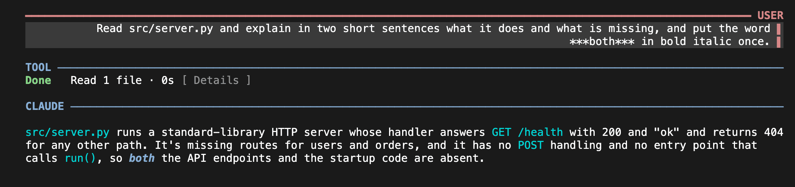

Chat

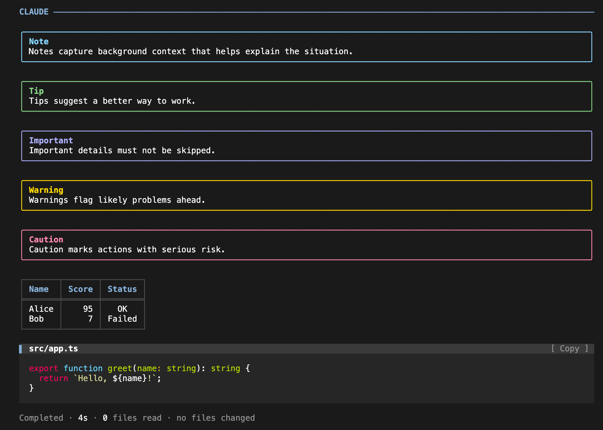

Tables, alerts and code panels

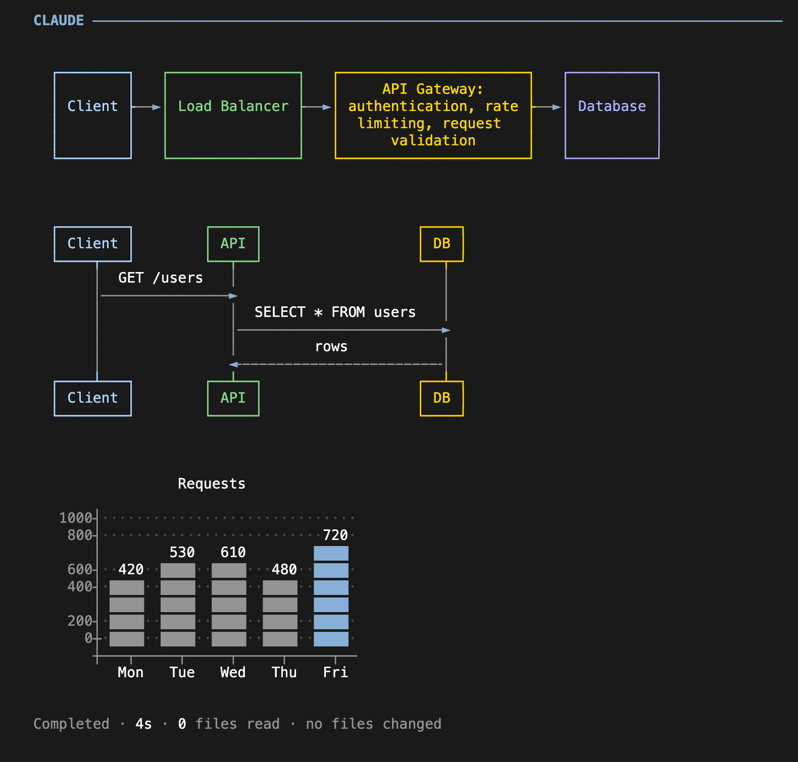

Mermaid diagram

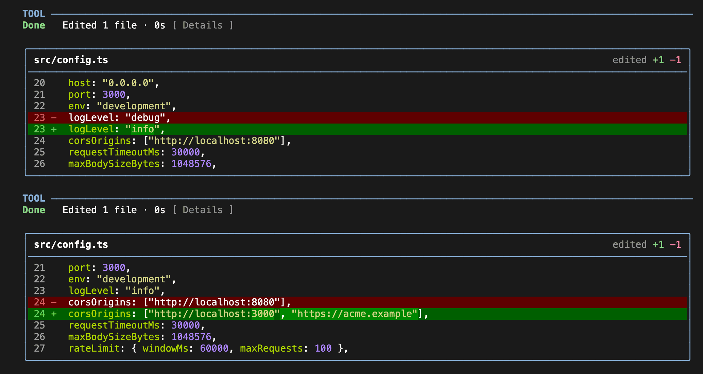

Edit diff panel

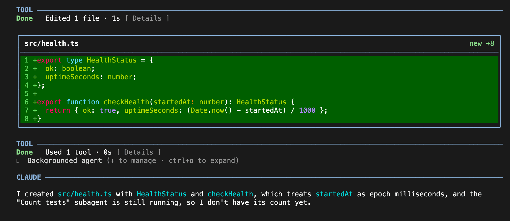

Write panel

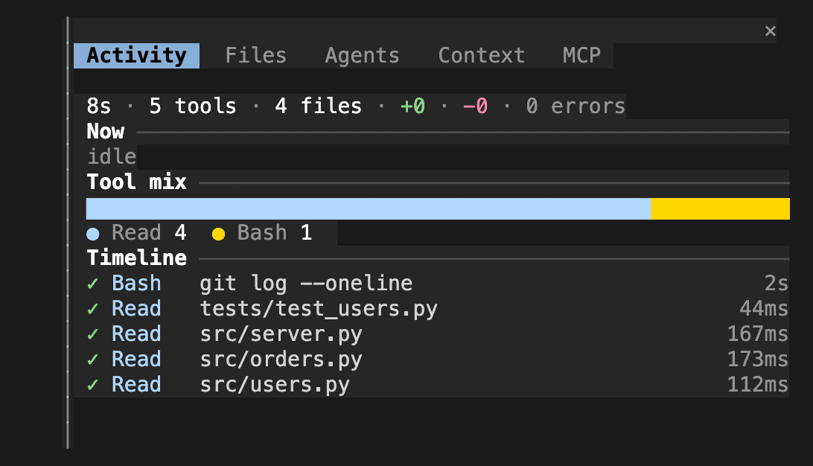

Activity tab

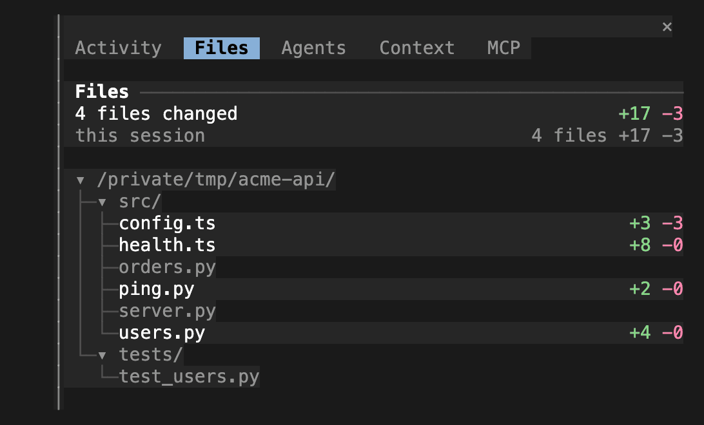

Files tab

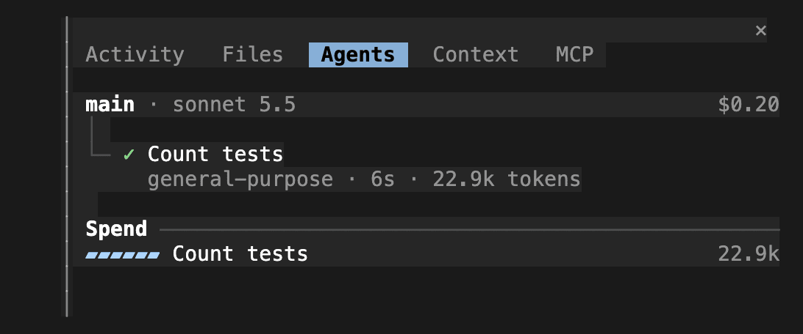

Agents tab

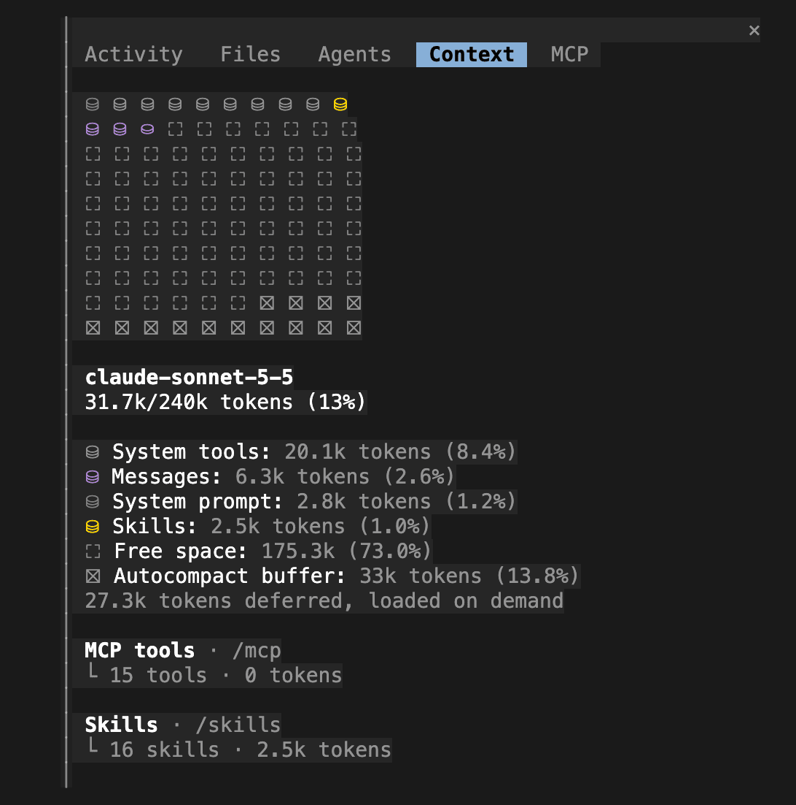

Context tab

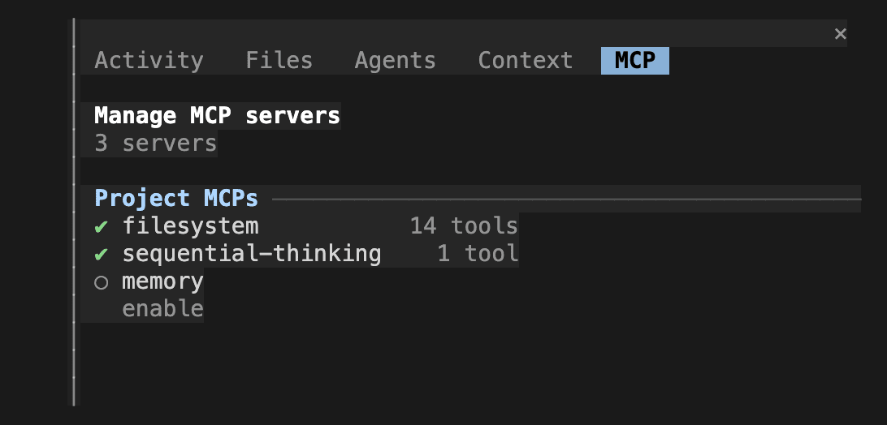

MCP tab

## Install

### Requirements

- Claude Code 2.1.289 or newer. That is the version I built it on and tested against.
- A terminal at least 110 columns wide for the docked pane. In the fullscreen layout the pane docks beside the chat from 110 columns. In the main-screen layout (the default under tmux, or with `CLAUDE_CODE_NO_FLICKER=0`) it opens inline above the prompt at any width.
- The pane opens when a session starts. Run `/session` to open it again after you close it.
- Node.js, only if you want to run the checks (see Development).

### Steps

Add the marketplace and install the plugin inside Claude Code:

```
/plugin marketplace add markneonin/paneline
/plugin install paneline@paneline
```

Third-party marketplaces do not update by themselves. Turn on auto-update in `/plugin` > Marketplaces to get new versions.

To run from a clone instead, pass the folder with `--plugin-dir` for one session:

```sh
git clone https://github.com/markneonin/paneline
```

```sh
claude --plugin-dir /path/to/paneline
```

To load it every time, put these in your shell profile instead:

```sh
export CLAUDE_CODE_PLUGIN_DIRS=/path/to/paneline
```

The plugin id is `paneline`. It has one option, `probe`, which writes render times to the debug log. It is off by default.

## Development

```sh
npm install
npm run check
```

Scripts:

- `npm run lint`: ESLint with the strict type-checked typescript-eslint rules.
- `npm run format` and `npm run format:check`: Prettier, write or verify.
- `npm run typecheck`: `tsc -p .`.
- `npm test`: `claude plugin test .`.
- `npm run check`: all four.

`claude plugin validate .` checks the manifest.

Notes:

- The hooks are TypeScript in `hooks/`. Tests are in `tests/`.
- The pre-commit hook (husky and lint-staged) lints and format-checks staged files, then type-checks.
- `typecheck` and `lint` need the plugin type definitions in `.claude-plugin/types/`. Claude Code generates them on your machine and git ignores them, so a clean checkout or CI cannot run these two checks.
- `claude plugin test` has no coverage option, so there is no coverage report.
- The code has no comments. Names and tests have to explain it.

## License

[MIT](LICENSE) (c) 2026 Mark. The Mermaid renderer in `hooks/vendor/` is third-party code, see [THIRD_PARTY_NOTICES.md](hooks/vendor/THIRD_PARTY_NOTICES.md).
